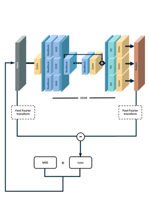
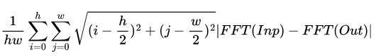
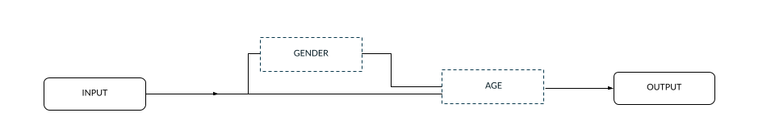
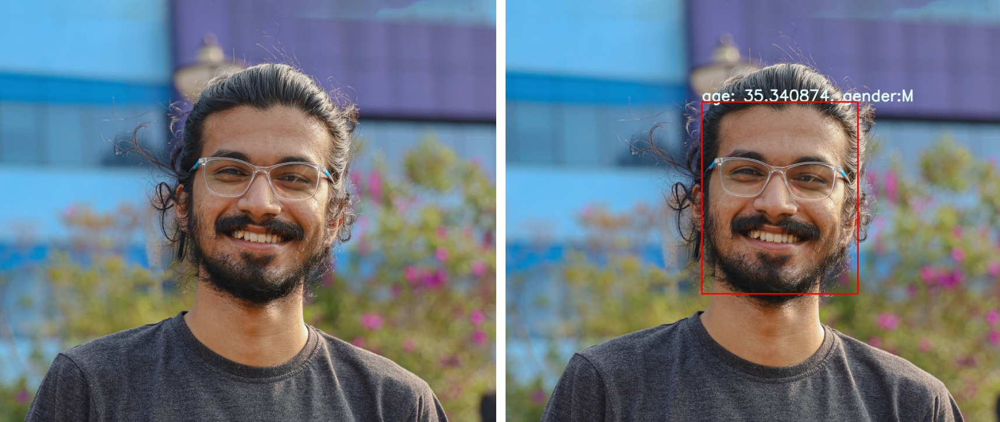

# BOSCH’S AGE AND GENDER DETECTION - FOURIERISE - TEAM 5

<!--  -->

Our documentation can be found [here](https://drive.google.com/file/d/11CJIVj3UhRu33CvbxbGY8n1Ma2U0qr6X/view?usp=sharing)

## Overview

  The scenes obtained from a surveillance video are usually with low resolution. Most existing digital video surveillance systems rely on human observers for detecting specific activities in a real-time video scene. However, there are limitations in the human capability to monitor simultaneous events in surveillance displays. Low-quality images require super resolution techniques to be visually perceptible and then we can use age and gender estimation techniques for a wide range of applications like abnormal
event detection, person counting in a dense crowd, person identification, gender classification, for elderly people.

## Problem Statement

  Build a solution to estimate the gender and age of people from a surveillance video
  feed (like mall, retail store, hospital etc.). Consider low resolution cameras as well as
  cameras put at a height for surveillance.

## Table of Contents

1. [Installation](#installation)
2. [How To Run](#how-to-run)
3. [Eval Datasets](#evaluation-datasets)
4. [Methodology](#methodology)
5. [File Structure](#file-structure)
6. [How to use the UI](#how-to-use-the-ui)

# Installation

This repository is built in PyTorch 1.8.1 and tested on Ubuntu 20.04 environment (Python3.7, CUDA11.3.1). Follow these intructions

1. Clone the repository  

    ```bash
    git clone https://github.com/Inter-IIT-Bosch-Mid-Prep/Bosch-Age-Gender-Detection.git
    ```

2. Run the following command to create the proper conda environment with all the required dependencies  

    ```bash
    cd Bosch-Age-Gender-Detection
    conda env create -f env.yml
    ```

3. Activate the conda environment

    ```bash
    conda activate bosch
    ```

4. Go to weights directory and create 2 folders inside it

    ```bash
    cd weights
    mkdir age_prediction gender_prediction
    ```

5. Download the NDF weights for age prediction from [here](https://drive.google.com/file/d/14qzcY89CeO6mbWetfamMWRuRNQ0OHpxY/view?usp=sharing) and extract it to the ```${root}/weights/age_prediction/```.

6. Download the VGGFace Gender weights from [here](https://drive.google.com/file/d/19axDtqsPmdW7mT_Z8s8ci85YVlTtiyLO/view?usp=sharing) and extract it to the ```${root}/weights/gender_prediction/```

7. If you want to use SwirIR, Download the SwinIR weights from [here](https://drive.google.com/file/d/1t0eAgSiZphK_WyWZY-y2WHyHkgQfjmDL/view?usp=sharing) and extract it to the ```${root}/weights/gan_weights/```

8. If you want to use BSRGAN, Download the BSRGAN weights from [here](https://drive.google.com/file/d/15PEIICDU3ZNFFoiIMuBIpqch7dncQNFb/view?usp=sharing) and extract it to the ```${root}/weights/gan_weights/```

# How To Run

To run the entire pipeline on a single video you can use the below command  

```bash
python detect.py --run_on_image <BOOL TO RUN ON IMAGE OR VIDEO>
                 --save_csv_location <PATH TO SAVE CSV OUTPUT>
                 --weights_yolo <PATH_TO_WEIGHTS_of_YOLO_V5>
                 --video_image <PATH_TO_VIDEO>
                 --img-size  <INFERENCE_SIZE_IN_PIXELS>  
                 --weights_gan <PATH_TO_WEIGHTS_OF_GAN>
                 --output_folder <PATH_TO_SAVE_OUTPUT_IMAGES>
                 --facelib <BOOL VALUE TO USE FACELIB OR NOT>
                 --sr_type <1-EDSR, 2-SwinIR, 3-BSRGAN>
                 --deblur_weights <PATH TO PRETRAINED WEIGHTS>
                 --gender_pred <IF 0 THEN USE VGG FACE>
                 --gender_weights <PATH OF VGG GENDER MODEL WEIGHTS>
                 --age_pred <IF VALUE 0 USE NDF>
                 --age_weights <PATH TO FINETUNED WEIGHTS> 
                 --cuda <TRUE IF WANT TO USE CUDA>
```

Note that all cofigurations are optional here. To run the etire pipeline with default configuration on test.mp4, run the following command :-

```bash
python detect.py 
```

For using our UI using streamlit, run the below command and upload the photo

```bash
streamlit run app.py
```

We have provided support for 3 kinds of SR algorithms - EDSR, SWINIR and BSRGAN. Our default used is EDSR as other two models are very heavy. This can be used by using different values of sr_type  

1. (EDSR)
2. (SwinIR)
3. (BSRGAN)
 
By default the output will be make in the ${root} directory in the name of name_csv_file.csv

# Evaluation Datasets

For testing our pipeline and individual blocks we have come up with some open-source datasets as well as our manually collected datasets.

The opensource datasets can be found below and the manually collected datasets can be found [here](https://drive.google.com/drive/folders/1PiLLjvLvAejUwd3JZl53D92SPGD_EXA1?usp=sharing)


<div align="center">

| Task                      | Dataset Link                                                                                                 |
|---------------------------|--------------------------------------------------------------------------------------------------------------|
| Face Detection            | [WiderFace](http://shuoyang1213.me/WIDERFACE/)                                                               |
|                           | [FDDB](http://vis-www.cs.umass.edu/fddb/)                                                                    |
| Age and Gender Estimation | [UTKFace](https://susanqq.github.io/UTKFace/#:~:text=Introduction,%2C%20occlusion%2C%20resolution%2C%20etc.) |
|                           | [CACD](https://bcsiriuschen.github.io/CARC/)                                                                 |
|                           | [Adience](https://talhassner.github.io/home/projects/Adience/Adience-data.html)                              |
|                           | [IMDB-WIKI](https://data.vision.ee.ethz.ch/cvl/rrothe/imdb-wiki/)                                            |
</div>
We also tested our Face Detection algorithms on manually degraded UTKFace datasets for sanity checks.

# Methodology


## Initial Preprocessing

We are initially extracting the individual frames from the given input video and then applying state of the art denoising methods. We have provided an option to the user to apply denoising methods such as [Restormer](https://github.com/swz30/Restormer) or [HINet](https://github.com/megvii-model/HINet).

## Face Detection

We analysed the problem statement from various perspectives and finally decided to go ahead with face detection.

1. Firstly, surveillance videos usually record humans from a height which obfuscates information about height and pose. Applying height and pose estimation algorithms on the top of person detection algorithms would have proven computationlly expensive.
2. Secondly clothing information would have introduced a stereotypical bias which would have been harmful for marginalized groups.

Thus we decided to use Face detection algorithms. For our pipeline we have integrated [Yolov5-face](https://github.com/deepcam-cn/yolov5-face). We had also tried out various other object detection algorithms however in our own test datasets we did not get satisfactory results in terms of Mean Accuracy Precision(mAP).


<div align="center">

| Model      | mAP   |  
|------------|-------|
| TinaFace   | 94.17 |
| YoloV5     | 95.99 |  
| RetinaFace | 91.45 |  

</div>

## Super Resolution

### Preprocessing for Super Resolution

We have extensively tested super resolution algorithms and realised that the extracted images usually contained blurred photos which rendered the super resolution algorithms useless and gave sub-par performance on age and gender tasks. Thus we added a new preprocessing block of [Deblurring](https://github.com/swz30/MPRNet)

We have provided comparision for Wall Time, PSNR and SSIM accross multiple Super Resolutiom methods
<div align="center">

| MODEL           | Custom Metric | Wall Time    | PSNR        |
| --------------- | ------------- | ------------ | ----------- |
|                 |               |              |             |
| WDSR            | 345.5003798   | 15.85164261  | 30.36618739 |
| EDSR            | 347.6678516   | 2.112349987  | 30.34467902 |
| SRGAN           | 354.7159776   | 9.196819544  | 29.42405326 |
| FSRCNN          | 430.6859193   | 0.3795514107 | 23.69700551 |
| RDN             | 307.7455076   | 0.3795514107 | 24.58058639 |
| SRDenseNet      | 408.9996247   | 17.12142944  | 24.05288471 |
| ESPCN           | 362.0292181   | 0.4130887985 | 25.14499845 |
| FSRCNN\_trained | 575.1895184   | 0.8021452427 | 21.94459659 |

</div>
From the above metrics in order to maintain a trade off between wall time and PSNR value we have chosen EDSR as our main backbone of super resolution architecture.

### Weighted Frequency Aware Super Resolution Algorithm

The entire super resolution pipeline can be shown as <p align="center"></p>

We have addressed the main pain point of the Problem statement.

- Just to give an overview, the existing super resolutions algorithms provided a high Peak Signal-to-Noise Ratio(PSNR) value but failed to preserve high frequency details of the image.
- Also existing super resolution algorithms are usually modifications of SRGANs which require expensive computation to train and have loss convergence issues.

```Thus we introduced a novel technique where we introduce a new loss in addition to exisitng reconstruction loss without introducing any new network parameters. Thus we follow the same training procedure but optimize the parameters with respect to the new loss which actually helps in preserving the high frequency components.```

The loss is formulated as <p align="center"></p>

## Age and Gender Prediction

We have also done extensive experimentation on age and gender prediction. First we did a sanity check whether super resolution was useful for our task hence we ran benchmarks tests with and without super resolution whilst considering VGGFace as the classification model. The results are shown below

<div align="center">

| Image size | No SR | BSRGAN | EDSR  | SwinIR |
|------------|-------|--------|-------|--------|
| 7x7        | 0.287 |  0.241 | 0.314 |  0.252 |
| 14X14      | 0.352 |  0.313 | 0.386 |  0.313 |
| 28x28      | 0.488 |  0.499 | 0.523 |  0.495 |
| 56x56      | 0.513 | 0.5342 | 0.551 |  0.533 |

</div>

This shows us a general increase in accuracy for age prediction in the case of EDSR accross all the image sizes. We have taken all possible image sizes as Yolov5-face returns faces with different dimensions from the range of 7x7 to 96x96.

### Gender

- For the gender classification task since we only have 2 labels using a deeper and complex model would overfit to the data hence we train some layers of the original VGGFace model which reported a test accuracy of 94% and we are using that in our final pipeline.  

<div align="center">

|   MODEL  | DATASET | ACCURACY | PRECISION |  RECALL  |    F1   |
|:--------:|:-------:|:--------:|:---------:|:--------:|:-------:|
|  Facelib | Adience |  0.73386 |  0.73404  | 0.735218 | 0.73357 |
|          |   UTK   |  0.78948 |  0.79971  |  0.79349 | 0.78889 |
| VGG Face | Adience |  0.7492  |   0.7632  |  0.7541  | 0.74424 |
|          |   UTK   |  0.9139  |   0.9245  |  0.9219  |  0.9028 |
|  Resnet  | Adience |  0.4821  |   0.4931  |  0.4956  |  0.4732 |
|          |   UTK   |  0.9369  |   0.9378  |  0.9413  |  0.9217 |
|    MLP   | Adience |  0.8543  |   0.8612  |  0.8711  |  0.8422 |
|          |   UTK   |  0.9257  |   0.9033  |  0.9341  |  0.9160 |
</div>

### Age

- For the age classification task, we faced quite a number of challenges such as
  1. Non-uniformity in dataset labels
  2. Subpar Cross-dataset performance in existing state-of-the-art models

- To address these problems, we improved upon exisitng models in these ways:

    1. We first performed the gender classification and used that gender embedding as a prior to the age classification which helped us improve our results.  
        
    2. In order to generalize our datasets, we performed a model ensemble across multiple datasets and this made our model much more robust.
    3. We have use a new ensembling technique where more weight is given to age clusters grouped together by inversely weighting difference between predicted ages.

- For our age classification tasks, after extensive experimentation we have use the following models
    1. [VisualizingNDF](https://github.com/Nicholasli1995/VisualizingNDF) trained on CACD
    2. [VisualizingNDF](https://github.com/Nicholasli1995/VisualizingNDF) trained on CACD and finetuned on WIKI and UTKface
    3. [VisualizingNDF](https://github.com/Nicholasli1995/VisualizingNDF) trained on CACD and finetuned on WIKI
    4. [VGGFace](https://github.com/rcmalli/keras-vggface) trained on IMDB

<div align="center">

| Model                   | MSE       | RMSE     | R-square  | MAE      |
| ----------------------- | --------- | -------- | --------- | -------- |
| Deep Face (Retina Face) | 332.0787  | 18.223   | \-7.78913 | 14.3249  |
| Deep Face (Opencv)      | 332.8555  | 18.24432 | \-5.4156  | 14.3404  |
| Deep Face (SSD)         | 326.2908  | 18.06352 | \-6.4814  | 14.17737 |
| InsightFace             | 424.6219  | 20.60635 | \-0.46678 | 15.8082  |
| FaceLib                 | 211.54167 | 14.5444  | 0.286898  | 10.09992 |
</div>

# File Structure

```bash
├── age_gender_prediction/
    ├── VGGFace
    ├── VisualizingNDF
├── Deblur/
    ├── MPRNet
├── Denoising/
    ├── HINet
    ├── Restormer
├── ObjDet/
├── Super_Resolution/
    ├── bicubic_pytorch
    ├── ESPCN_pytorch
├── imgs/
├── README.md
```

# How to Use the UI

After running the command for streamlit, a new window opens up in the default browser. This code is directly using our codebase as a backend and takes an API call for running the model. Users can choose the type of GAN from the dropdown list and then upload the image from local system. Then the processing happens in the backend and the output image is rendered with the corresponding bounding box with the age and gender information.

For the help of the user, a walkthrough is shown below


The final prediction is shown below on a test image

