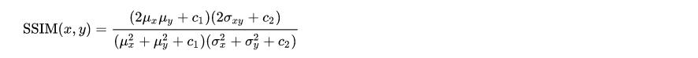
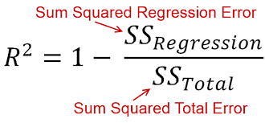

# BOSCH’S AGE AND GENDER DETECTION
## Overview
  Over the recent years, detecting human beings in a video scene of a surveillance system is 
  attracting more attention due to its wide range of applications in abnormal event detection, 
  human gait characterization, person counting in a dense crowd, person identification, 
  gender classification, fall detection for elderly people, etc.

## Description 
  The scenes obtained from a surveillance video are usually with low resolution. 
  Most of the scenes captured by a static camera are with minimal change of background. 
  Objects in outdoor surveillance are often detected in far-fields. Most existing digital 
  video surveillance systems rely on human observers for detecting specific activities in a 
  real-time video scene. However, there are limitations in the human capability to monitor 
  simultaneous events in surveillance displays. Hence, human motion analysis in automated video 
  surveillance has become one of the most active and attractive research topics in the 
  area of computer vision and pattern recognition.

## Problem Statement
  Build a solution to estimate the gender and age of people from a surveillance video 
  feed (like mall, retail store, hospital etc.). Consider low resolution cameras as well as 
  cameras put at a height for surveillance.

# How To Run
    python --weights <PATH_TO_WEIGHTS_of_YOLO_V%5 --video <PATH_TO_VIDEO> --img-size <INFERENCE_SIZE_IN_PIXELS> --weight_gan <PATH_TO_WEIGHTS_OF_GAN> --output_folder <PATH_TO_SAVE_OUTPUT_IMAGES>

# Venv To Run The Code
    $ conda create --name age_and_gender_detection python=3.8
    $ conda activate age_and_gender_detection
    $ pip install opencv-python
    $ conda install pytorch torchvision torchaudio cudatoolkit=<YOUR_CUDA_VERSION> -c pytorch
    $ conda install -c conda-forge tqdm
    $ pip install pyyaml
    $ conda install -c conda-forge matplotlib
    $ conda install -c anaconda pandas
    $ conda install -c anaconda seaborn
    $ pip install tensorflow
    $ pip install deepface

# File Structure

# Results:

# Tables
## Super Resolution Models
| MODEL           | Custom Metric | Wall Time    | PSNR        | ssim         | pnsr        | time        |
| --------------- | ------------- | ------------ | ----------- | ------------ | ----------- | ----------- |
|                 |               |              |             |              |             |             |
| WDSR            | 345.5003798   | 15.85164261  | 30.36618739 |              |             |             |
| EDSR            | 347.6678516   | 2.112349987  | 30.34467902 |              | 34.01466825 | 448.2856143 |
| SRGAN           | 354.7159776   | 9.196819544  | 29.42405326 |              |             |             |
| FSRCNN          | 430.6859193   | 0.3795514107 | 23.69700551 |              |             |             |
| RDN             | 307.7455076   | 0.3795514107 | 24.58058639 |              |             |             |
| SRDenseNet      | 408.9996247   | 17.12142944  | 24.05288471 |              |             |             |
| ESPCN           | 362.0292181   | 0.4130887985 | 25.14499845 |              |             |             |
| FSRCNN\_trained | 575.1895184   | 0.8021452427 | 21.94459659 | 0.7368627344 |             |             |

## Adience Dataset
### Gender
| Model                   | Accuracy |  | Recall   | Precision | F1      | False Positive Rate |
| ----------------------- | -------- |  | -------- | --------- | ------- | ------------------- |
| Deep Face (Retina Face) | 0.67123  |  | 0.68     | 0.68811   | 0.66945 | 0.4423              |
| Deep Face (Opencv)      | 0.672523 |  | 0.68303  | 0.696     | 0.66939 | 0.46332             |
| Deep Face (SSD)         | 0.65992  |  | 0.67072  | 0.68387   | 0.65633 | 0.47964             |
| InsightFace             | 0.72428  |  | 0.72254  | 0.72332   | 0.72282 | 0.2487              |
| FaceLib                 | 0.73386  |  | 0.735218 | 0.73404   | 0.73357 | 0.283954            |

### Age
| Model                   | MSE       | RMSE     | R-square  | MAE      |
| ----------------------- | --------- | -------- | --------- | -------- |
| Deep Face (Retina Face) | 332.0787  | 18.223   | \-7.78913 | 14.3249  |
| Deep Face (Opencv)      | 332.8555  | 18.24432 | \-5.4156  | 14.3404  |
| Deep Face (SSD)         | 326.2908  | 18.06352 | \-6.4814  | 14.17737 |
| InsightFace             | 424.6219  | 20.60635 | \-0.46678 | 15.8082  |
| FaceLib                 | 211.54167 | 14.5444  | 0.286898  | 10.09992 |

## Self Trained Models

|                    | epochs | LR            | Val\_acc | test-acc-utk | test-acc-adience | Details                                      | Weight Filename              |
| ------------------ | ------ | ------------- | -------- | ------------ | ---------------- | -------------------------------------------- | ---------------------------- |
| resnet\_gender\_v1 | 10     |               | 93.7     | 93.6         | ~48              |                                              |                              |
|                    |        |               |          |              |                  |                                              |                              |
| VGG-Face-Gender    | 250    | 1.00E-03      | 91.15    | 90.71        | 82.62            | (imagenet weights)                           | gender\_model\_weights.h5    |
|                    | 400    | 1e-4(LRSched) | 92.92    | 91.39        | 74.9             | (imdb-gender-weights)                        | gender\_model\_weights\_1.h5 |
| VGG-Face-Age       |        |               |          |              |                  | (imagenet weights)(10 classes)               |                              |
| IMDB-gender-eval   | 100    | 1.00E-03      | 97.65    |              |                  | reproducing gender model results of vgg face | IMDB-gender-eval.h5          |

# **BOSCH AGE AND GENDER DETECTION**

- [Frame extraction]
- [Denoising (real)](#denoising-real)
- [Object Tracking](#object-tracking)
- [Object Detection Models](#object-detection-models):
  - [YOLO\_V5]
  - [Tinaface]
  - [Retinaface]
- [Preprocessing](#preprocessing-reasons)
  - [Imageaug] (contrast, rain, exposure, sunlight, etc.) {Not yet added in pipeline will be done by tomorrow and added here as well , Anant}()
  - [Motion Blur Removal](#motion-blur-removal)
  - [Face Alignment](#face-alignment)
    - [Deepface](#deepface)
      - [OpenCV]
      - [SSD]
      - [Dlib]
      - [MTCNN]
      - [Retinaface]
- [Super Resolution Models](#super-resolution-models-1)
  - [Early Upsampling Design](#early-upsampling-design)
    - [SRCNN](#srcnn)
    - [VDSR](#vdsr)
  - [Late Upsampling Design](#late-upsampling-design)
    - [FSRCNN](#fsrcnn)
    - [ESPCN](#espcn)
  - [Densely connected Networks](#densely-connected-networks)
    - [RDN](#rdn)
    - [SRDenseNet](#srdensenet)
  - [With GANs](#with-gans)
    - [SRGAN](#srgan)
    - [ESRGAN](#esrgan)
  - [Single Stage Residual Network](#single-stage-residual-network)
    - [EDSR](#edsr)
    - [WDSR](#wdsr)
- [Age and Gender Prediction Models](#age-and-gender-prediction-models)
  - [Deepface](#deepface-1)
    - [Retina Face](#retina-face)
    - [OpenCV](#opencv-1)
    - [SSD](#ssd-1)
  - [MLP](#mlp)
  - [FaceLib (ShuffleNet)](#facelib-shufflenet)
  - [InsightFace](#insightface)
  - [VGG-Face-Gender](#vgg-face-gender)
  - [Resent\_gender\_v1](#resentgenderv1)

## Frame extraction
    Text to be added
## Denoising (real)
    text to be added
## Object Tracking
    text to be added
## Object Detection Models:
> ### YOLO\_V5:
    text to be added

> ### Tinaface:
    text to be added
> ### Retinaface:
    text to be added

## Preprocessing: {Reasons}
    text to be added
> ### Imageaug (contrast, rain, exposure, sunlight, etc.) {Not yet added in pipeline will be done by tomorrow and added here as well , Anant}]
    text to be added
> ### Motion Blur Removal:
    The images we are targeting are sometimes blurred due to motion (like the person moving, etc). 
    In order to tackle that we used MRPNet, a synergistic design model that can optimally balance 
    between spatial details and high-level contextualized information while recovering images. Specifically, our model first learns the contextualized features using encoder-decoder 
    architectures and later combines them with a high-resolution branch that retains local information. 
    A key ingredient in such a multi-stage architecture is the information exchange between different stages.

> ## Face Alignment:
    Text to be added
>> ### Deepface :
>>> #### OpenCV:
>>> #### SSD
>>> #### Dlib
>>> #### MTCNN
>>> #### Retinaface
> ## Super Resolution Models:
    why super resolution?
>> ### Early Upsampling Design:
    little about early upsampling design
>>> #### SRCNN:

    SRCNN is a simple CNN architecture consisting of three layers: one for patch extraction, 
    non-linear mapping,​ and reconstruction. The patch extraction layer is used to extract dense 
    patches from the input, and to represent​ them using convolutional filters. The non-linear 
    mapping layer consists of 1×1 convolutional filters used to change the ​number of channels 
    and add non-linearity. As you might have guessed, the final reconstruction layer reconstructs 
    the high-resolution image.

 
>>> #### VDSR:

    Very Deep Super Resolution (VDSR) is an improvement on SRCNN, with the addition of the 
    following​ features. As the name signifies, a deep network with small 3×3 convolutional 
    filters ​is used instead of a smaller network with large convolutional filters. This is 
    based on the VGG architecture. The network tries to learn the residual of the output image 
    and the interpolated input, rather​ than learning the direct mapping (like SRCNN), as shown 
    in the figure above. This simplifies the task. The initial low-resolution image is added to 
    the network output to get the final HR output. Gradient clipping is used to train the deep 
    network with higher learning rates.

>> ### Late Upsampling Design
    little about late upsampling design
>>> #### FSRCNN:

    The major changes between SRCNN and FSRCNN is that there is no pre-processing or upsampling 
    at the beginning. The feature extraction took place in the low-resolution space​. A 1×1 
    convolution is used after the initial 5×5 convolution to reduce the number of channels, 
    and hence ​lesser computation and memory, similar to how the Inception network is developed​. Multiple 3×3 convolutions are used, instead of having a big convolutional filter, similar 
    to how the VGG network works by simplifying the architecture to reduce the number of parameters.​ Upsampling is done by using a learned deconvolutional filter, thus improving the model. 
    FSRCNN ultimately achieves better results than SRCNN, while also being faster.

>>> #### ESPCN:

    ESPCN introduces the concept of sub-pixel convolution to replace the deconvolutional layer 
    for ​upsampling.This is done in order to resolve the checkerboard issue in deconvolution, 
    which occurs due to the overlap​ operation of convolution as well as is computationally 
    efficient compared to deconvolution in high resolution space. As seen in the diagram below, 
    sub-pixel convolution works by translating depth to space. In a high resolution image, pixels 
    from numerous channels in a low resolution image are reassembled into a single channel. 
    For example, a 5x5x4 pixel input image can be converted to a 10x10 HR image by rearranging 
    the pixels in the final four channels to a single channel.

>> ### Densely connected Networks
>>> #### RDN:

    Most deep CNN based SR models do not make full use of the hierarchical features from the 
    original low-resolution (LR) images, thereby achieving relatively-low performance. A Residual 
    Dense Network (RDN) is used to tackle this in image SR by exploiting the hierarchical features 
    from all the convolutional layers. A Residual Dense Block (RDB) is used to extract abundant 
    local features via dense connected convolutional layers. RDB further allows direct connections 
    from the state of preceding RDB to all the layers of current RDB, leading to a contiguous 
    memory (CM) mechanism. Local feature fusion in RDB is then used to adaptively learn more 
    effective features from preceding and current local features and stabilizes the training 
    of wider network.

>>> #### SRDenseNet:
    Text to be added

>> ### With GANs:
>>> #### SRGAN:

SRGAN uses a GAN-based architecture to generate visually pleasing images. It uses the SRResnet 
network architecture as a backend, and employs a multi-task loss to refine the results. The 
loss consists of three terms taking into consideration the pixel similarity (MSE Loss), 
Perceptual similarity Loss and an Adversrial loss by a discriminator. Although the results 
obtained had comparatively lower PSNR values, the model achieved more MOS, i.e a better 
perceptual quality in the results. 

>>> #### ESRGAN:

    ESRGAN improves on top of SRGAN by adding a relativistic discriminator. The advantage is 
    that the network is trained not only to tell which image is true or fake, but also to make 
    real images look less real compared to the generated images, thus helping to fool the 
    discriminator. Batch normalization in SRGAN is also removed, and Dense Blocks (inspired 
    from DenseNet) are used for better information flow. These Dense Blocks are called RRDB.

>> ### Single Stage Residual Network:
>>> #### EDSR:

  The EDSR architecture is based on the SRResNet architecture, consisting of multiple residual 
  blocks. The residual block in EDSR is shown above. The major difference from SRResNet is that 
  the Batch Normalization layers are removed. The author states that BN normalizes the input, 
  thus limiting the range of the network; removal of BN results in an improvement in accuracy. 
  The BN layers also consume memory, and removing them leads to up to a 40% memory reduction, 
  making the network training more efficient. 
 

>>> #### WDSR:

    This is a model with same parameters and computational budgets as EDSR, but with wider features before ReLU activation and has significantly better for single image super resolution (SISR). 
    A new linear low-rank convolution is introduced into the SR network which gives better accuracy-efficiency tradeoff. In addition, compared with batch normalization or no 
    normalization, training with weight normalization leads to better accuracy for deep 
    super-resolution networks

> ## Age and Gender Prediction Models:
    text to be added
>> ### Deepface:
    text to be added
>>> #### Retina Face:
    text to be added
>>> #### OpenCV:
    text to be added
>>> #### SSD:
    text to be added
>> ### MLP:
    text to be added

>> ### FaceLib (ShuffleNet):
    text to be added

>> ### InsightFace:
    text to be added
>> ### VGG-Face-Gender:
    text to be added
>> ### Resent\_gender\_v1:
    text to be added

> ## METRICS :
>> ### For Super Resolution:
>>> #### PSNR Value : 
    Peak Signal to Noise Ratio is the most common technique used to determine the quality of 
    results. It can be calculated directly from the MSE using the formula below, where L is 
    the maximum pixel value possible (255 for an 8-bit image).

>>> #### Custom Metric : 
    This is calculated by dividing the sum of absolute value of difference between corresponding 
    pixels of high resolution image and image obtained by super resolution of the downsampled 
    high resolution image by the number of pixels in the image.
>>> #### SSIM Value : 
    This metric is used to compare the perceptual quality of two images using the formula below, 
    with the mean (μ), variance (σ), and correlation (c) of both images.

>>> #### Wall time :
    Text to be added

>> ### For Gender:

>>> #### Accuracy:
    Ratio of the number of correct Predictions to total number of predictions Accuracy should be 
    as high as possible.

>>> #### Recall: 
    Ratio of the number of true positives to the number of actual positives. Recall should be high 
    as possible.

>>> #### Precision: 
    Ratio of the number of true positives to the number of total positive predictions. Precision 
    should be high as possible.

>>> #### F1: 
    It is difficult to compare two models with low precision and high recall or vice versa. So to 
    make them comparable, we use F-Score. F-score helps to measure Recall and Precision at the same 
    time. It uses Harmonic Mean in place of Arithmetic Mean by punishing the extreme values more.

>>> #### False Positive Rates: 
    Ratio of the number of False positives to the total number of actual negatives.

>> ### For Age:

>>> #### MSE: 
    Mean Squared Error 

>>> #### RMSE: 
    Root Mean Squared Error 

>>> #### R-Square: 
    R-Squared is the ratio of the sum of squares regression (SSR) and the sum of squares total (SST). 
    Sum of Squares Regression (SSR) represents the total variation of all the predicted values found 
    on the regression line or plane from the mean value of all the values of response variables. 
    The sum of squares total (SST) represents the total variation of actual values from the mean 
    value of all the values of response variables

>>> #### MAE: 
    Mean Absolute Error

------------------------------------------
THINGS TO ADD :-

1. Challenges
2. Solutions/ novelty

—-----------------------------------------